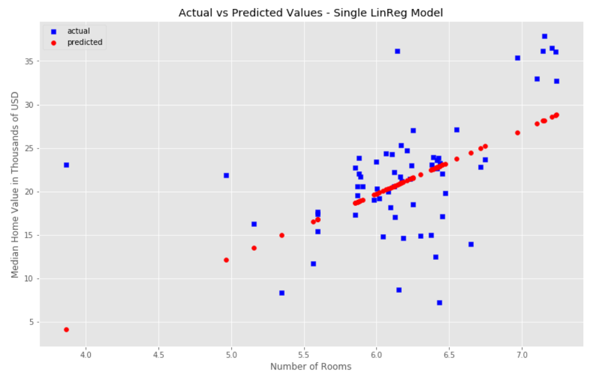
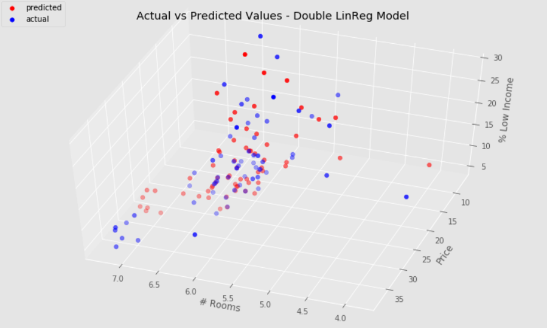

# Comparing Single vs. Multiple Linear Regression with Price Prediction

*By Danny Vu*

I will take a housing dataset which contains information about mean housing information per suburb in Boston. This data was originally a part of UCI Machine Learning Repository and has been removed now. We can also access this data from the scikit-learn library or Kaggle. 

### Objective 

The objective is to build a model that accurately predicts the mean value of prices in Boston given a certain set of features.

The prices of the house indicated by the variable MEDV is our target variable and the remaining are the feature variables based on which I will predict the value of a house.

**I will compare the error statistics of a Single Linear Regression Machine Learning Model vs a Multiple Linear Regression Machine Learning Model.**

### Feature Description:

- CRIM: Per capita crime rate by town
- ZN: Proportion of residential land zoned for lots over 25,000 sq. ft
- INDUS: Proportion of non-retail business acres per town
- CHAS: Charles River dummy variable (= 1 if tract bounds river; 0 otherwise)
- NOX: Nitric oxide concentration (parts per 10 million)
- RM: Average number of rooms per dwelling
- AGE: Proportion of owner-occupied units built prior to 1940
- DIS: Weighted distances to five Boston employment centers
- RAD: Index of accessibility to radial highways
- TAX: Full-value property tax rate per 10,000 USD
- PTRATIO: Pupil-teacher ratio by town
- B: 1000(Bk —0.63)², where Bk is the proportion of people of African American descent by town
- LSTAT: Percentage of lower status of the population
- MEDV: Median value of owner-occupied homes in 1000s USD

# Summary of Results:

I trained a linear regression machine learning model, tested it, and then calculated the error metrics for both a single vs double featured model. My 2-featured model showed much improvement if we compare the error metrics in our prediction. Take a comparing look at the error metrics in both the models:

| Type of Model | MSE | RMSE | R^2 |
| -------- | -------- | -------- | -------- |
| 1-feature (RM) | 35.4 | 5.9 | 0.23 |
| 2-feature (RM & LSTAT) | 18.0 | 4.2 | 0.61 |

The error metrics (MSE and RMSE) have both gone down while the R^2 accuracy of prediction has gone up. Our 2-featured model predicts much more accurately than the 1-featured model. The RMSE states that my 2-featured model has a +/- error range of 4.2 thousand US dollars.

This is a comparing visual of the two model predictions compared to the actual prices in our testing data:

Continue below to see the full analysis as well as a prediction on a data-set that doesn't have prices.
